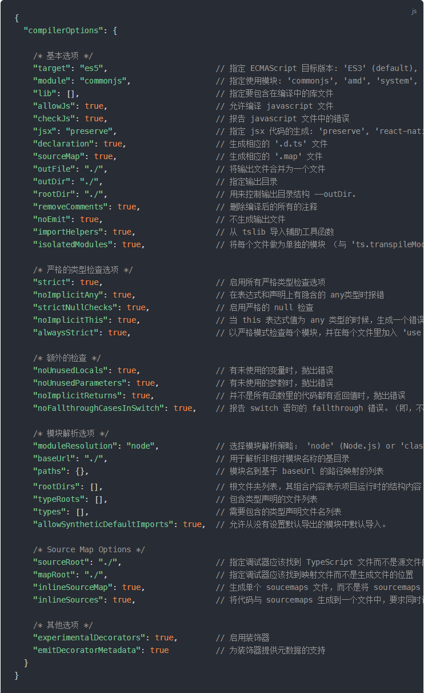

# TypeScriptPrictice
TypeScript 练习工程，两周任务，必须结束。每天花20分钟总结一下。
- TypeScript 介绍
    - 编译上下文和配置
        - [x] tsconfig.json 的变量类型和编译的内容，来源：[深入理解 TypeScript](https://jkchao.github.io/typescript-book-chinese/project/compilationContext.html#%E7%BC%96%E8%AF%91%E9%80%89%E9%A1%B9 "深入理解TypeScript")
    
        - 声明空间
            - 在 TypeScript 里存在两种声明空间：类型声明空间与变量声明空间
    - 文件模块
        - 如果在你的 TypeScript 文件的根级别位置含有 import 或者 export，它会在这个文件中创建一个本地的作用域。
        - `import { foo } from './foo';
           const bar = foo; // allow`
        - 在 bar.ts 文件里使用 import，不但允许你使用从其他文件导入的内容，而且它会将此文件 bar.ts 标记为一个模块，文件内定义的声明也不会污染全局命名空间。
        - commonjs, amd, es modules, others
            - AMD：不要使用它，它仅能在浏览器工作；
            - SystemJS：这是一个好的实验，已经被 ES 模块替代；
            - ES 模块：它并没有准备好。
        - 标准写法：`import {a,b} from './xxx';` 需要注意的地方是
            - 你也可以重命名变量导出：`import {a as a1} from 'modelA'`
    
- TypeScript 类型系统
- JSX
- TypeScript 异常
- TIPS 笔记
